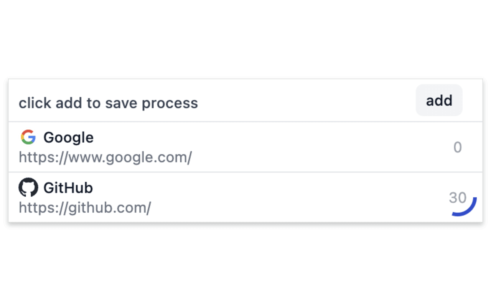

This is a chrome extension that helps you keep track of the websites and your progress

[chrome store](https://chromewebstore.google.com/detail/gafonnbnhagekemckhokjjbadcmlpgeb)

- Supports regex, automatically update the current site and progress when url matching, very conducive to reading online books
- When the site matches will highlight the icon, need to pin the extension icon
- Support only match the tab page opened by the extension, don't worry about the progress being overwritten.
- Support editing name and mark

https://github.com/yjrhgvbn/regex-reading-list/assets/32033682/be8cf20f-502d-44b9-8521-619c7cf8a1b7

