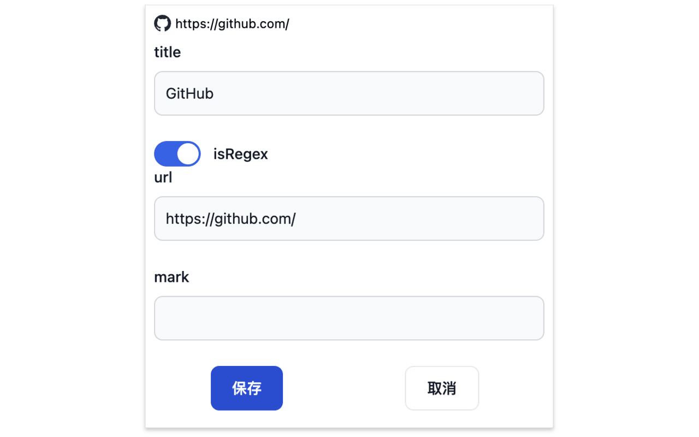

This is a chrome plugin that helps you keep track of the websites and your progress

* Supports regex, automatically update the current site and progress when url matching, very conducive to reading online books
* When the site matches will highlight the icon, need to pin the plugin icon
* Support only match the tab page opened by the plugin, don't worry about the progress being overwritten.
* Support editing name and mark

